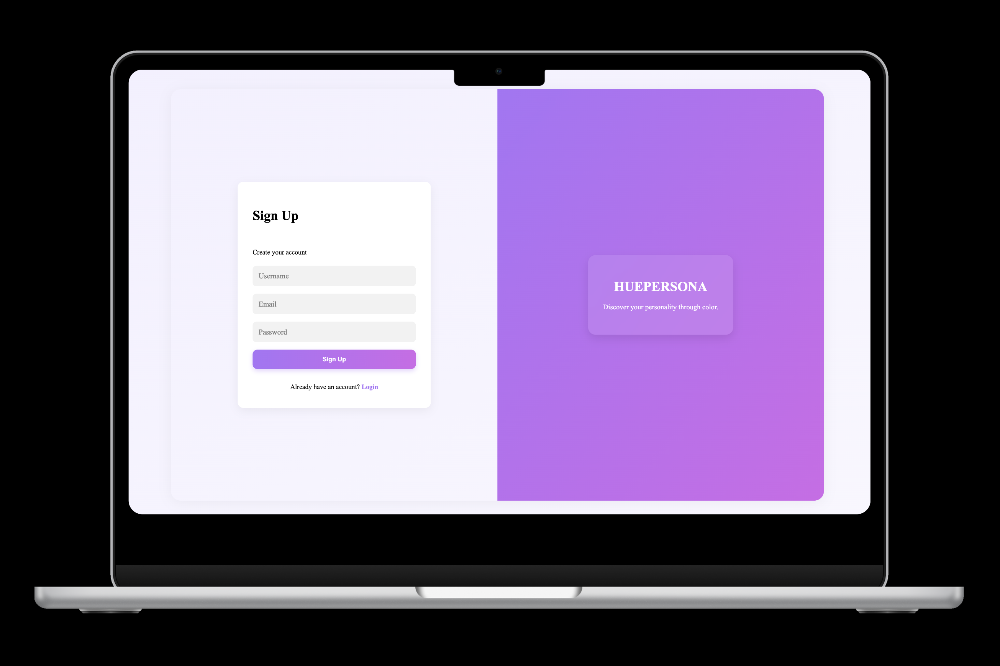

# 🎨 HuePersona

HuePersona is a full-stack web application that blends personality psychology with color theory. Users can take a curated test to discover a color palette that reflects their personality traits — calm, bold, or balanced — and build a personalized collection of favorite colors.

## HuePersona Demo

## Project Overview

**HuePersona** combines interactive design, cultural psychology, and intuitive UX into one engaging platform. Users can register, log in securely, take a color personality test, receive a custom palette, and manage their own color collection — all within a sleek, responsive interface built using the MVC architecture.

---

## Built With

- **Node.js** + **Express.js**
- **MongoDB** + **Mongoose**
- **JWT Authentication**
- **MVC Architecture (Model–View–Controller)**
- **Server-side Rendering (JSX via express-react-views)**
- **CSS with Custom Styling**

---

## Features

-  **Authentication**: Sign up, Login, and secure user sessions via JWT.
-  **Personality Test**: Answer 10 curated questions to discover your matching color palette.
-  **Dynamic Color Index**: View all your saved and suggested colors in a visually appealing grid.
-  **Add, Edit, Delete Colors**: Manage your personal collection.
-  **Results Stored**: Personality test results and colors are saved for future insight.
-  **RESTful Routing**: Full MVC routing with data and view controllers.
-  **Validation & Error Handling**: Mongoose validation, form error messages, and clean UX.

---

 ## HuePersona Route Table
 ### Auth Routes

| Method          | Route         | Description                       | 
| --------------- | --------------| ----------------------------------| 
| GET             | `/auth`       | Show sign-up form                 | 
| POST            | `/auth`       | Handle sign-up form & create user | 
| GET             | `/auth/login` | Show login form                   | 
| POST            | `/auth/login` | Handle login & return token       | 
| PUT             | `/auth/:id`   | Update user                       | 
| DELETE          | `/auth/:id`   | Delete user                       |

### Color Routes

| Method | Route              | Description                      |
| ------ | -------------------| ---------------------------------|
| GET    | `/colors`          | Show logged-in user's color index|
| GET    | `/colors/new`      | Show form to create new color    |
| POST   | `/colors`          | Create a new color               |
| GET    | `/colors/:id`      | Show a single color detail       |
| GET    | `/colors/:id/edit` | Show form to edit a color        | 
| PUT    | `/colors/:id`      | Update a color                   |
| DELETE | `/colors/:id`      | Delete a color                   |

### Personality Test Routes

| Method | Route             | Description                               |
| ------ | ------------------| ------------------------------------------|
| GET    | `/colors/test`    | Show personality test form                |
| POST   | `/colors/results` | Submit test answers and generate palette  |

### Result Routes  
(Handled inside controller, no public GET/POST)

---

## Bonus Features

* **RESTful API** for front-end/client interaction.
* Load testing with **Artillery**.
* Cloud deployment for public access.

---

## Tech Stack

* **Backend:** Node.js, Express.js
* **Database:** MongoDB, Mongoose
* **Authentication:** JWT
* **Frontend:** React
* **Styling:** CSS 
* **Testing:** Jest 

---

## Inspiration

HuePersona is inspired by Korean color analysis tests that connect personality traits to color preferences — a playful blend of psychology and visual identity. Built with a full-stack MVC architecture, it showcases how structure can fuel creativity: Mongoose models handle rich user and color data, React-based views bring the experience to life, and controllers orchestrate the flow. By combining cultural insight with modern web development patterns, HuePersona turns personal expression into an interactive, self-discovery journey.
