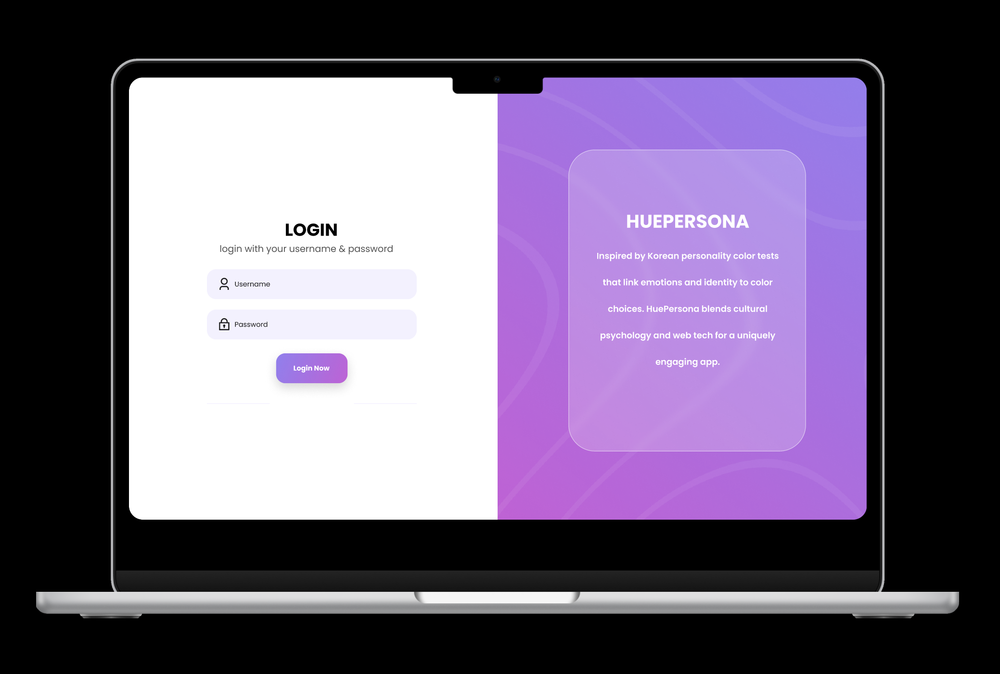

# HuePersona 

A full-stack MVC web application inspired by the Korean color analysis test that helps users discover their color palette based on their favorite colors.

## Demo

## Project Overview

**HuePersona** combines psychology, design, and interactivity in a user-centric platform. It allows users to register, take a color-based personality test, view personalized results, and manage a list of their favorite colors.

---

## Core Features

### 1. Models

* **User Model**

  * Fields: `username`, `email`, `password`, `favoriteColors` (Array of Color IDs)
* **Color Model**

  * Fields: `name`, `hexValue`, `description`, `relatedTraits` (Array of Strings)
* **Relationships**

  * A user can have multiple favorite colors.
  * Each color is associated with specific personality traits.

---

### 2. MVC Architecture

* **Models**

  * Built with Mongoose for `User` and `Color`.
* **Views**

  * Dynamic user interfaces for login, registration, test-taking, and results using EJS or React.
* **Controllers**

  * Encapsulated route logic for user authentication and color analysis.

---

### 3. Authentication System

* JWT-based user authentication.
* Protected routes for:

  * Viewing/modifying favorite colors.
  * Accessing personality test results.

---

### 4. Unit Testing

* Test suite for `User` model includes:

  * User creation.
  * Password hashing and validation.
  * User lookup.

---

### 5. Styling

* Responsive UI using **CSS**.

---

## Implementation Steps

1. **Initialize Project**

   * Set up Node.js, Express, Mongoose, and folder structure (`models/`, `views/`, `controllers/`, `routes/`).

2. **Create Models**

   * Implement and relate `User` and `Color` models in Mongoose.

3. **Set Up Authentication**

   * Use `jsonwebtoken` for signing/verifying tokens.
   * Middleware to protect sensitive endpoints.

4. **Color Analysis Logic**

   * Interface to choose colors.
   * Backend logic to map colors → profile.

5. **CRUD Functionality**

   * Full CRUD on user's favorite colors.

6. **Unit Testing**

   * Use Jest for model and auth testing.

7. **Styling and UX**

   * Polish design for usability and personality.

8. **Deployment**

   * Deployed using ......

---

## Route Table

 Protected Routes (JWT Required)
 User Routes

| Method | Route                 | Description                   |
| ------ | --------------------- | ----------------------------- |
| GET    | `/user/profile`       | View logged-in user's profile |
| GET    | `/user/favorites`     | View favorite colors          |
| POST   | `/user/favorites`     | Add a color to favorites      |
| DELETE | `/user/favorites/:id` | Remove a color from favorites |

## Color Routes

| Method | Route         | Description                      |
| ------ | ------------- | -------------------------------- |
| GET    | `/colors`     | List all colors                  |
| GET    | `/colors/:id` | View one color with traits       |
| POST   | `/colors`     | Add a new color  |
| PUT    | `/colors/:id` | Update a color   |
| DELETE | `/colors/:id` | Delete a color   |

## Personality Test Routes

| Method | Route           | Description                     |
| ------ | --------------- | ------------------------------- |
| GET    | `/test`         | Show personality test           |
| POST   | `/test`         | Submit test answers             |
| GET    | `/test/results` | View user’s latest test results |

---

## Bonus Features

* **RESTful API** for front-end/client interaction.
* Load testing with **Artillery**.
* Cloud deployment for public access.

---

## Tech Stack

* **Backend:** Node.js, Express.js
* **Database:** MongoDB, Mongoose
* **Authentication:** JWT
* **Frontend:** EJS / React
* **Styling:** CSS 
* **Testing:** Jest 

---

## Inspiration

Inspired by Korean color analysis tests that link personality and identity to color choices. HuePersona blends cultural psychology and web tech for a uniquely engaging app.

---

## Conclusion

HuePersona is a creative full-stack project with solid technical foundations, intuitive UI, and a playful concept. It’s an ideal beginner-to-intermediate project that showcases authentication, data relationships, MVC structure, testing, and user-centered design.